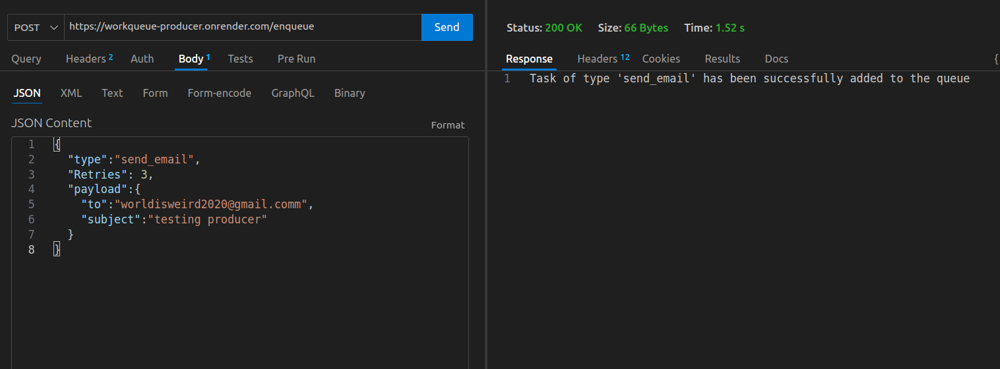

# WorkQueue

A Distributed Background Task Processing System written in Go, using Redis for job queuing.

**High level overview**
    


## What's the need for this?

This system is designed to handle the processing and execution of background tasks concurrently to improve user experience.

**Example:** When a user signs in to your website and clicks the login button, you might want to send them a welcome email. If that email task is part of the API call, the user would have to wait until the email is sent. Instead, you can add the "send_email" task to WorkQueue and let it handle the execution in the background.

**Note:** This is built to be modular — any type of job can be added to it, not just sending emails. You just need to add the logic for that job as described below.

## Services

This repo provides two independent services:

### 1. Producer

Provides a `/enqueue` route to add your jobs/tasks.

#### How to add a job?

- Send an HTTP POST request to the exposed `/enqueue` route on this URL: [workqueue-producer](https://workqueue-producer.onrender.com/enqueue)
- It accepts a task in this format (JSON):

**Example: An inbuilt task the system supports is sending an email. Its JSON request would look like this:**

```json
{
    "type": "send_email",
    "Retries": 3,
    "payload": {
        "to": "worldisweird2020@gmail.com",
        "subject": "testing producer"
    }
}
```

- **type** - REQUIRED. Tells the producer the type of job being added to the queue.
- **Retries** - Number of times the system should try to enqueue the job if it fails.
- **Payload** - Contains details about the task in key-value pairs (Note: you can add any type/number of key-value pairs inside the payload, as the backend is built to flexibly accept all types).

This is the Go struct type it accepts:

```go
type Task struct {
    Type    string                 `json:"type"`
    Payload map[string]interface{} `json:"payload"`
    Retries int                    `json:"retries"`
}
```

The response will look like this:



### 2. Worker

- Takes the jobs from the queue in a reliable manner and executes them
- Provides a `/metrics` endpoint to view statistics

#### How to view the status of your job?

Send an HTTP GET request to [worker-url](https://workqueue-worker.onrender.com/metrics)

This will give a response like this:


- **total_jobs_in_queue** - Number of jobs inside the Redis queue at that moment
- **jobs_done** - Total number of jobs executed so far
- **jobs_failed** - Number of jobs that failed to execute, if any

## How are jobs executed?

Inside the `internal/worker/worker.go`, you will find this function. The switch case makes it modular enough so you can add your job type just by adding another case.

**To add a new type of task:** Just add its function inside a new switch case, and that's it!

```go
func Process_Task(task_to_execute task.Task) error {
    if task_to_execute.Payload == nil {
        return fmt.Errorf("payload is empty")
    }

    // Add your task type here, and perform the task under your switch case
    switch task_to_execute.Type {
    case "send_email":
        time.Sleep(2 * time.Second)
        fmt.Println("Sending email to ", task_to_execute.Payload["to"], " with subject ", task_to_execute.Payload["subject"])
        return nil
    case "resize_image":
        fmt.Println("Resizing image to x coordinate: ", task_to_execute.Payload["new_x"], " y coordinate: ", task_to_execute.Payload["new_y"])
        return nil
    case "generate_pdf":
        fmt.Println("Generating pdf...")
        return nil
    case "":
        return fmt.Errorf("task type is empty")
    default:
        return fmt.Errorf("unsupported task")
    }
}
```

## Additional features

- **Concurrency** is provided to enable fast execution using goroutines and the sync package.

- **Logging** of each event is provided and stored inside the logs.txt file. This helps to trace back the success or failure of a job.

Example:

